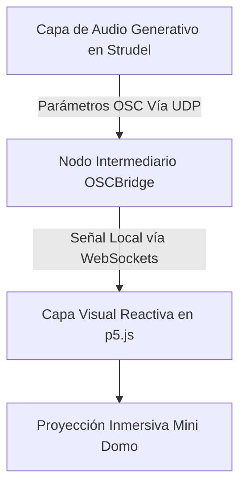

# 📤 Bitácora 5 - Tormenta de Datos (Unidad 5)

---

## Actividad 01: Concepto de la Obra

**¿Qué quieres comunicar o provocar con tu obra? (intención artística/estética)**
Quiero comunicar la "ansiedad digital" y provocar una sensación de inmersión total en la sobrecarga tecnológica y la extrema velocidad de la era contemporánea. La estética se basa en el ruido algorítmico, el ritmo hiper-mecanizado y el flujo abrumador de información.

**¿En qué contexto se presentará? (sala oscura, espacio abierto, escenario, etc.)**
Se presentará en un espacio de instalación cerrado, preferentemente un **Mini Domo** o una sala oscura envolvente a media luz, maximizando el aislamiento sensorial para potenciar la acústica y el contraste de las proyecciones visuales parpadeantes.

**¿Cuál es la experiencia que deseas para el público? (contemplativa, participativa, inmersiva, etc.)**
Se busca una experiencia **inmersiva e hiper-estimulante**. Comenzará con un silencio tenso espeluznante, casi contemplativo, que escalará violentamente hacia una tormenta electrónica opresiva e hipnótica, ahogando los sentidos de la audiencia.

**¿Qué rol tendrá el público? (observador, participante activo, co-creador, etc.)**
El público tendrá un rol de **observador inmerso**. Su rol principal es el de un partícipe sensorial pasivo enfrentado al volumen de datos, permitiendo que la obra lo sature por completo. A futuro, este rol podría derivar parcialmente en "participante activo" mediante envío de variables externas a la red interna que rige el servidor.

**Primer diagrama de arquitectura del sistema:**


**Al menos 3 referentes artísticos o técnicos:**
1. **Ryoji Ikeda**: *data.tron* / *Supercodex* ([Ver video](https://www.youtube.com/watch?v=XzX1kE1KIEc)).
2. **Autechre (Warp Records)**: *Gantz Graf* ([Ver video](https://www.youtube.com/watch?v=evqsOFQju08)).
3. **Alva Noto (Carsten Nicolai)**: *Xerrox Series* ([Ver proyecto](https://alvanoto.com/)).

---

## Actividad 02: Investigación de referentes y técnicas (Seek)

**Los referentes encontrados y por qué son relevantes para tu obra:**
- **Ryoji Ikeda** es vital porque utiliza frecuencias extremas, *clicks* informáticos y estática pura combinada con proyecciones visuales matemáticas hipercodificadas. Es la inspiración directa para la base estética tecnológica de los pings, redes y el comportamiento láser.
- **Autechre** es relevante porque su música abraza y expone el caos controlado algorítmico. Su obra *Gantz Graf* muestra visuales abstractos en 3D que reaccionan agudamente al diseño de sonido más fracturado e industrial, demostrando que el error de sistema (el *glitch*) también puede tener bases rítmicas hipnóticas aplicables a mi proyecto.
- **Alva Noto** es relevante por el uso impecable de las reverberaciones inmensas y ecos sintéticos en fallos acústicos, características estéticas que son absolutamente necesarias para darle la envergadura y sensación de escala "gigante" pretendida en el escenario de tipo Mini Domo.

**Las técnicas de audio generativo que planeas usar y por qué se ajustan a tu concepto:**
- **Live Coding Multicapa (Strudel/TidalCycles)**: Se usará programación en vivo con sintaxis de bucles concadenados, porque una "Tormenta de Datos" no debe ser un escenario musical de audio estático, esta debe evolucionar de manera impredecible y reaccionar a variables modulares en tiempo real.
- **Manipulación Destructiva de Ondas (Bitcrush, Jux rev y LPF/HPF)**: Usaré funciones matemáticas destructivas para machacar los sonidos de fábrica introduciendo distorsión opresiva a propósito, encajando estéticamente con los principios teóricos del arte del *Data Overload*.
- **Arreglos Lógicos de Variación Dinámica (0 a 3)**: Almacenaré listas de comportamientos métricos donde un simple ajuste de variable externa sobre el código desatará mutaciones mucho más agresivas y veloces en todas las 8 subcapas a la vez.

---

## Actividad 03: Implementación del audio generativo (Build)

**El proceso de creación de tu audio generativo:**
El proceso creativo inició conceptualizando 8 capas sonoras autónomas y designándoles un rol narrativo particular de "arquitectura computacional": el ambiente tétrico inicial (Pad y Drone), la base pesada de las máquinas del servidor (Kick 909 y Bass 303), el tráfico y fuga de datos (bips y hi-hats ultrarrápidos de CPU) y el propio exceso destructivo de bits informáticos junto a las sirenas de sistema crítico. En lugar de escribir ritmos paralelos fijos, programé 8 matrices métricas donde cada matriz contiene saltos o cuatro umbrales que ascienden desde un patrón muy lento y silenciado (caos nivel 0) hasta una avalancha estroboscópica abrumadora (caos nivel 3). Finalmente, orquesté todo de manera unificada mediante el REPL.

**Las decisiones técnicas y estéticas que tomaste y por qué:**
1. **Opacidad Industrial:** Quería el espectro característico sucio del techno industrial primitivo; decidí usar bancos potentes (como la TR909), pero aplicándoles barridos limitadores de frecuencia continua (`lpf`) para apagar intencionalmente su color o viveza melódica y que sonaran rudos y toscos desde el primer golpe.
2. **Sincronía Nativa Audio-Visual**: Decidí rechazar un cliente HTTP engorroso, en favor de encadenar sub-comandos originarios `.osc()` al pie de cada evaluación musical de Strudel; así el núcleo emite su partitura percutida, permitiendo una conectividad en milisegundos directa hacia los estroboscopios gráficos con HTML Canvas y p5.js.

**El código completo de tu pieza de audio:**
```javascript
setcpm(135/4)

// VARIABLES DINÁMICAS (0 a 3) - Cambia aquí en vivo mediante Shift+Enter
let SYNTH_PAD = 0; let BASS_DRIVE = 0; let KICK_BEAT = 0; let HIHAT_SWARM = 0;
let DATA_NOISE = 0; let GLITCH_STORM = 0; let VOICE_CHOP = 0; let ALARM_STATE = 0;

/* --- 1. SYNTH PAD (Atmósfera) --- */
const padScores = ["c2 ~ ~ ~", "c2 ~ eb2 ~", "c2 g2 eb2 c3", "<[c2 g2] [eb2 c3] [ab1 eb2] [g1 d2]>"]
const PAD = note(padScores[SYNTH_PAD]).s("sawtooth").lpf(800).sustain(4).room(0.9).sz(0.9).gain(0.6)

/* --- 2. BASS DRIVE (Bajo Ácido TB303) --- */
const bassScores = ["~", "c1(3,8)", "c1*8", "[c1 c2]*8"]
const BASS = note(bassScores[BASS_DRIVE]).s("tb303").lpf(600).gain(0.7).jux(rev)

/* --- 3. KICK BEAT (Impacto Industrial) --- */
const kickScores = ["~", "bd(1,4)", "bd(3,8) ~", "bd*4"]
const KICK = s(kickScores[KICK_BEAT]).bank("RolandTR909").lpf(150).room(0.2).gain(1.3)

/* --- 4. HIHAT SWARM (Alta Frecuencia) --- */
const hatScores = ["~", "~ hh", "hh*8", "hh*16"]
const HIHATS = s(hatScores[HIHAT_SWARM]).bank("RolandTR909").gain(0.5).pan(perlin)

/* --- 5. DATA NOISE (Pings de Red y Servidor) --- */
const dataScores = ["~", "bleep(2,8)", "cpu(5,8)", "print(3,8) [cpu*4]"]
const DATA = s(dataScores[DATA_NOISE]).hpf(2000).gain(0.8)

/* --- 6. GLITCH STORM (Destrucción y Bitcrush) --- */
const glitchScores = ["~", "glitch", "hc(3,8) glitch", "[glitch*8, hc*16]"]
const GLITCH = s(glitchScores[GLITCH_STORM]).jux(rev).crush(3).gain(0.8)

/* --- 7. VOICE CHOP (Fragmentación Sintética) --- */
const voiceScores = ["~", "vocal(1,8)", "vocal(3,8)", "vocal*8"]
const VOICE = s(voiceScores[VOICE_CHOP]).chop(8).jux(rev).gain(0.9).room(0.4)

/* --- 8. ALARM STATE (Colapso Crítico) --- */
const alarmScores = ["~", "~", "~", "c6*2"]
const ALARM = note(alarmScores[ALARM_STATE]).s("sine").room(0.8).gain(0.6).chop(4)

/* --- MEZCLA GENERAL (Audio Output) --- */
$: stack(PAD, BASS, KICK, HIHATS, DATA, GLITCH, VOICE, ALARM).gain(0.8)

/* --- TRANSMISIÓN (Señales de Sincronía Visual hacia OSCBridge) --- */
$: stack(PAD.osc(), BASS.osc(), KICK.osc(), HIHATS.osc(), DATA.osc(), GLITCH.osc(), VOICE.osc(), ALARM.osc())
```

**Instrucciones paso a paso para reproducir tu audio:**
1. Despliega un intérprete OSC local (ej. `node bridge.js`) en la raíz del proyecto para aperturar el canal WebSocket 3000 de escucha.
2. Inicia un servidor local de Vite encapsulado apuntando explícitamente y sin choques al entorno ejecutando `pnpm dev --port 5000` en terminal.
3. Abre el navegador web en la dirección base `http://localhost:5000/`.
4. Copia del repositorio el respectivo código alfanumérico provisto arriba exactamente como está y plásmalo en el editor del intérprete iterativo (REPL).
5. Presiona la combinación **Shift + Enter**. Observa que las variables de intensidad de **0 a 3** escalan acústica y gráficamente alterando radicalmente el ambiente bajo evaluación interactiva al vuelo.

---

## Actividad 04: Consolidación y metacognición (Reflect)

**Evalúa si el audio generativo logra la intención estética. ¿Qué ajustarías?**
La partitura programática logra completamente el estridente y pesado objetivo estético original: la temida "ansiedad digital". Todo quedó brillantemente orquestado gracias al contraste en los cortes mecánicos, los chirridos hiperveloces fragmentados y el bajo masivo TB303. Lo único que me animaría a refinar estructuralmente a futuro, sería integrar en sitio procesadores y sensores paramétricos reactivos (e.g. captadores volumétricos láser o micrófonos condesadores integrados) de manera que la propia "Tormenta" consuma nativa y directamente las exclamaciones reactivas del público utilizándolas como multiplicadores modulares paramétricos en lugar de los manuales 0, 1, 2, y 3.

**Diagrama de sistema actualizado:**
```mermaid
flowchart TD
    subgraph S ["Strudel REPL (Servidor Local Viteizado - Puerto 5000)"]
        V[8 Capas Analíticas / Variables del 0 al 3] --> M[Generador de Síntesis Generativa]
        M -->|Broadcast Interno Musicalizado .osc()| O((Paquetes Numéricos Estroboscópicos))
    end
    
    subgraph B ["Intermediario OSCBridge (Node.js)"]
        O -->|UDP: Escucha de Datos en 3333| R[Traductor y Parser Central JSON]
        R -->|Genera Emisión Perpendida TCP| W[WebSocket emisor bidireccional en 3000]
    end
    
    subgraph P ["Instalación del Espectador (visualesHouse p5.js)"]
        W -->|Receptor Web de Gráficos Asincrono ws://| V2[Canvas Creador / API HTML5]
        V2 -->|Respuesta luminosa milimétrica en DOM| D[Proyección Frontal / Esférica para Mini Domo]
    end
```

**Principales desafíos que enfrentaste y cómo los resolviste:**
El desafío procedimental originario y más complejo de sortear fue evadir el motor analizador de dependencias del framework estático inicial del mismísimo intérprete de Strudel. Mezclar código y variables arbitrarias densas dependientes de clientes explícitos WebSocket incrustados a capella, provocaba que el intérprete de JS fallara inusualmente quebrando bucles originando problemas "Mini Parse Errors" fatales. 

Se resolvió la anomalía descartando y purificando la sobre-escritura paramétrica manual dentro del intérprete; recurriendo entonces al redireccionamiento OSC originario puro del propio motor en lenguaje de base (a través de micro-colas paramétricas funcionales `().osc()`), logrando en un par de iteraciones una estabilidad alucinante de envío, cero cuellos de botella para el código de reproducción de partitura, y escalabilidad técnica impoluta. Paralelamente evitamos interferencias y reestructuramos el encapsulado de toda esta red final al puerto `5000`, manteniéndola ilesa frente a otros proyectos curriculares existentes en el terminal.
