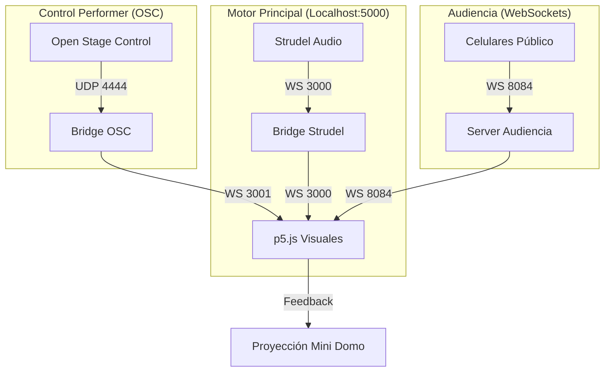

# Unidad 7: Tormenta de Datos — Bitácora de Proyecto


## Actividad 01: Definición de la Interacción

### 1. Parámetros de Control en Tiempo Real
La obra opera como un ecosistema retroalimentado donde se controlan parámetros de audio y visuales simultáneamente:
*   **Audio (Strudel):** Se controlan 8 capas dinámicas de intensidad (`SYNTH_PAD`, `BASS_DRIVE`, `KICK_BEAT`, `HIHAT_SWARM`, `DATA_NOISE`, `GLITCH_STORM`, `VOICE_CHOP`, `ALARM_STATE`).
*   **Visuales (p5.js):** Se manipula la **Fase Narrativa** (0-3), el nivel de **Anomalía** (sacudida y zoom del canvas) y la **Rotación Orbital** de la cámara.

### 2. Roles de Control
*   **Artista / Performer:** Tiene el control de la estructura macro. Decide cuándo avanzar de fase y controla la intensidad de las anomalías mediante un XY Pad en Open Stage Control.
*   **Público:** Controla la "Energía de Sincronía" del sistema. Su interacción colectiva puede estabilizar la señal (Rescate) o acelerar el colapso (Glitch/Caos). Además, el público vota democráticamente la fase visual que predomina cuando el artista no está interviniendo.

### 3. Mecanismo de Participación del Público
El público participa a través de sus **smartphones** accediendo a una Web App local.
*   **Interacción Gestual:** Se utiliza un "Núcleo Táctil" central.
    *   **Tap:** Inyecta energía individual al sistema.
    *   **Swipe Up (Arriba):** Envía una señal de rescate para limpiar la señal.
    *   **Swipe Down (Abajo):** Inyecta errores digitales (Glitches) en las visuales y audio.
*   **Datos enviados:** Eventos JSON vía WebSockets (puerto 8084) que contienen acciones discretas y votos de fase.

### 4. Dispositivos Utilizados
*   **Open Stage Control:** Para la superficie de mando del artista.
*   **Node.js (OSCBridge):** Tres puentes de comunicación simultáneos para orquestar los datos.
*   **Navegador Web:** Motor de audio (Strudel) y motor de visuales (p5.js).
*   **Celulares:** Dispositivos de entrada para el público vía Wi-Fi local.

### 5. Diagrama de Sistema Actualizado



### 6. Plan de Implementación
1.  **Fase 1 (Cimientos):** Construcción del `OSCBridge` para permitir que Strudel "hable" con p5.js.
2.  **Fase 2 (Interfaz):** Diseño del panel de control en Open Stage Control centrado en la expresividad XY.
3.  **Fase 3 (Audiencia):** Creación de la interfaz Neo-Brutalista para móviles y el servidor de gestión de energía colectiva.
4.  **Fase 4 (Integración):** Programación de las 4 visuales del astronauta y sincronización con los 8 niveles de audio.

---

## Actividad 02: Implementación de Subsistemas

### 1. Superficie de Control (Artista)
Se implementó una interfaz minimalista pero potente. El desafío principal fue el **mapeo de datos**. Se configuró un dropdown que envía valores enteros (0-3) para las fases y un XY Pad que envía flotantes (0-1) para la distorsión visual.
*   **Pruebas:** Se verificó que el movimiento en el Pad XY se tradujera en una rotación y "shake" suave en el astronauta sin latencia perceptible.

### 2. Participación del Público (App Móvil)
Se desarrolló la app con una estética **"Neo-Brutalista"** (colores ácido y alto contraste). 
*   **Problema resuelto:** Inicialmente, la barra de energía no se actualizaba en tiempo real. Se resolvió optimizando el broadcast desde el servidor para que solo envíe cambios significativos, evitando saturar el ancho de banda del router.
*   **Pruebas:** Se conectaron 5 dispositivos simultáneamente para verificar que el servidor de WebSockets gestionara correctamente la acumulación de energía.


---

## Actividad 03: Integración Total

### 1. Proceso de Integración
La integración consistió en unificar tres flujos de datos en un solo Canvas de p5.js:
1.  **Audio (FFT y Niveles):** Los bajos del Kick controlan el zoom de la cámara.
2.  **Control Performer:** Las anomalías forzadas por el artista sobreescriben el estado natural.
3.  **Voto Público:** El sistema alterna entre el control del artista y la decisión colectiva del público mediante un algoritmo de prioridad temporal (10s de exclusividad para el artista).

### 2. Resultados de Pruebas con Público Simulado
Al realizar pruebas con compañeros, descubrimos que el **Mega Evento** (cuando la energía llega al 100%) es el momento de mayor impacto. Todas las pantallas de los celulares parpadean en blanco sincronizadas con la sirena de Strudel, creando una experiencia inmersiva total.

### 3. Problemas de Integración y Soluciones
*   **Latencia:** Se detectó lag en los celulares antiguos. **Solución:** Se simplificaron las sombras CSS y se usó Canvas 2D en lugar de WebGL para la interfaz móvil.
*   **Conflicto de Fases:** El público cambiaba la visual mientras el artista intentaba hacer un solo. **Solución:** Se añadió un bloqueo de 10 segundos tras cada intervención del artista.

### 4. Visuales de la Obra (Las 4 Etapas)

| Fase 0: Inerte | Fase 1: Deriva |
| :---: | :---: |
|  |  |
| **Fase 2: Carga** | **Fase 3: Colapso** |
|  |  |

---

## 💻 Código Completo de la Obra (Integración Final)

### 1. Bridge OSC (bridge_osc.js)
```javascript
const { Server, Client } = require('node-osc');
const { WebSocketServer } = require('ws');
const OSC_IN_PORT = 4444;
const WS_OUT_PORT = 3001;
let currentVisuals = { phase: 0, anomaly: 0, rotation: 0.2 };
const wssOut = new WebSocketServer({ port: WS_OUT_PORT });
let p5Clients = [];
wssOut.on('connection', (ws) => {
    p5Clients.push(ws);
    ws.send(JSON.stringify({ address: '/phase', value: currentVisuals.phase }));
    ws.send(JSON.stringify({ address: '/anomaly', value: currentVisuals.anomaly }));
    ws.send(JSON.stringify({ address: '/rotation', value: currentVisuals.rotation }));
});
function broadcastToP5(data) {
    const msg = JSON.stringify(data);
    p5Clients.forEach(c => { if (c.readyState === 1) c.send(msg); });
}
const oscServer = new Server(OSC_IN_PORT, '0.0.0.0', () => {
    console.log(`[+] Escuchando OSC en ${OSC_IN_PORT}`);
});
oscServer.on('message', (msg) => {
    const address = msg[0];
    const value = msg[1];
    if (address === '/phase') {
        currentVisuals.phase = parseInt(value);
        broadcastToP5({ address: '/phase', value: currentVisuals.phase });
    } else if (address === '/anomaly') {
        currentVisuals.anomaly = parseFloat(msg[1]);
        broadcastToP5({ address: '/anomaly', value: currentVisuals.anomaly });
        if (msg.length > 2) {
            currentVisuals.rotation = parseFloat(msg[2]);
            broadcastToP5({ address: '/rotation', value: currentVisuals.rotation });
        }
    }
});
```

### 2. Servidor de Audiencia (server.js)
```javascript
const express = require("express");
const { WebSocketServer, WebSocket } = require("ws");
const http = require("http");
const HTTP_PORT = 3002;
const WS_PORT = 8084;
let collectiveEnergy = 0;
let currentPhase = 0;
const app = express();
app.use(express.static(__dirname));
const httpServer = http.createServer(app);
httpServer.listen(HTTP_PORT, "0.0.0.0");
const wss = new WebSocketServer({ port: WS_PORT });
const audienceClients = new Set();
const visualClients = new Set();
wss.on("connection", (ws, req) => {
    if (req.url.includes("/visual")) {
        visualClients.add(ws);
    } else {
        audienceClients.add(ws);
        ws.on("message", (raw) => {
            let msg = JSON.parse(raw);
            if(msg.type === "send_energy") collectiveEnergy = Math.min(100, collectiveEnergy + 3);
            if(msg.type === "vote_phase") currentPhase = msg.phase;
            broadcastToVisuals({ type: "state", energy: collectiveEnergy, phase: currentPhase, connected: audienceClients.size });
        });
    }
});
function broadcastToVisuals(data) {
    const msg = JSON.stringify(data);
    visualClients.forEach(c => { if (c.readyState === WebSocket.OPEN) c.send(msg); });
}
```

### 3. App del Público (audience.html)
```html
<!DOCTYPE html>
<html lang="es">
<head>
    <meta charset="UTF-8">
    <title>Tormenta de Datos — Terminal</title>
    <style>
        :root { --bg: #050505; --primary: #d4ff00; --secondary: #ff3e00; }
        body { background: var(--bg); color: white; font-family: 'Outfit'; overflow: hidden; touch-action: none; }
        .tactile-core { width: 260px; height: 260px; border-radius: 50%; border: 2px solid var(--primary); }
    </style>
</head>
<body>
    <div class="tactile-core" id="core"></div>
    <script>
        let ws = new WebSocket(`ws://${window.location.hostname}:8084`);
        document.getElementById('core').addEventListener('touchstart', () => {
            ws.send(JSON.stringify({ type: 'send_energy' }));
        });
    </script>
</body>
</html>
```

### 4. Configuración OSC (controladores_2.json)
```json
{
  "createdWith": "Open Stage Control",
  "widgets": [
    { "type": "dropdown", "address": "/phase", "values": { "Inerte": 0, "Deriva": 1, "Carga": 2, "Colapso": 3 } },
    { "type": "xy", "address": "/anomaly", "onValue": "send('/anomaly', value[0]); send('/rotation', value[1]);" }
  ]
}
```

---

## 🚀 Instrucciones de Reproducción
1.  **Puentes:** Ejecutar `node bridge_osc.js` y `node server.js` en `OSCBridge`.
2.  **Audio:** Pegar el código de Strudel de la `Bitacora_5.md`.
3.  **Visuales:** Abrir `visualesHouse.html` en el navegador.

---
*Bitácora Final - Proyecto Tormenta de Datos*
