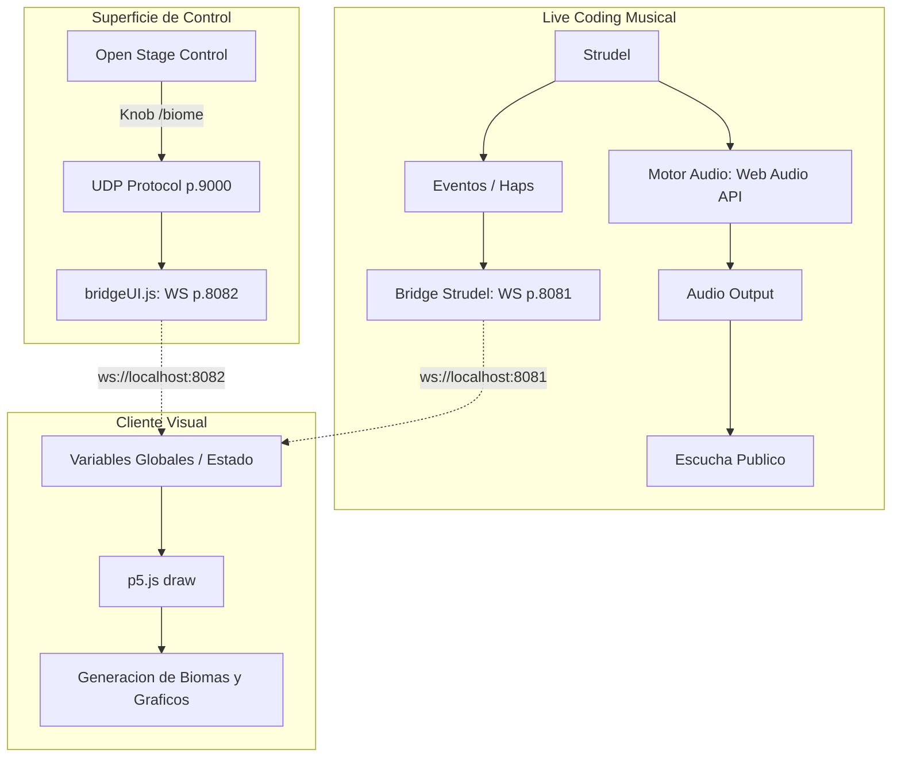

# Bitacora de Aprendizaje y Aplicacion: Open Stage Control

## Set: Que aprenderas en esta unidad?
**Objetivo:** Integrar superficies de control para manipular parametros de una obra audiovisual interactiva mediante el protocolo OSC.

**Documentacion de Configuracion (Open Stage Control):**
Para lograr que la interfaz fisica o virtual se comunique con el entorno web de p5.js, realice los siguientes pasos de configuracion de red e infraestructura:
1. Instalacion y ruteo: Levante Open Stage Control configurado para enviar paquetes OSC a traves de la red local por el puerto UDP 9000.
2. Creacion del "Puente" (Bridge): Dado que los navegadores web no pueden leer paquetes UDP nativos de OSC por motivos de seguridad, utilice un script intermedio en Node.js (`bridgeUI.js`).
3. Conversion de Protocolos: Este script utiliza la libreria `osc` de npm para escuchar el puerto UDP 9000. Al recibir un mensaje, lo decodifica y lo retransmite en formato JSON a traves de un servidor WebSocket local en el puerto 8082.

---

## Seek: Investigacion
**Seleccion del parametro visual:**
Al analizar la obra (`visualesHouse.html`), identifique que el mundo del videojuego reacciona a los ciclos y triggers de live coding de Strudel, pero carecia de una progresion narrativa manual. 
Decidi que el parametro a controlar seria el Bioma del Mundo (variable `SCENE` que va de 0 a 3). 

**Investigacion y Decisiones Tecnicas:**
1. Analisis de conectividad previa: Note que el juego en p5.js ya tenia un puente WebSocket en el puerto 8081 que recibia la musica de Strudel.
2. Decision Arquitectonica: En lugar de mezclar los mensajes de musica y control en un solo puerto (lo cual podria causar cuellos de botella o desincronizacion), investigue como implementar conexiones concurrentes. Decidi abrir una segunda conexion WebSocket independiente en p5.js hacia el puerto 8082, dedicada exclusivamente a recibir comandos de la superficie de control.
3. Diseno del Control: En Open Stage Control, disene un widget tipo "Knob" (perilla discreta) configurado para enviar valores enteros de 0 a 3 bajo la direccion OSC `/biome`.

---

## Apply: Aplicacion
**Ejecucion en el codigo de la obra:**
Lleve a cabo la programacion en el archivo `visualesHouse.html` para integrar la senal del Knob con los graficos generativos.

**Pasos documentados y fragmentos clave de codigo:**
1. Implementacion de la conexion WebSocket paralela (`connectOSC()`):
   Cree un manejador de eventos que escucha el puerto 8082, parsea el JSON y actualiza automaticamente las reconexiones en caso de caidas.
   ```javascript
   function connectOSC() {
     wsOSC = new WebSocket("ws://localhost:8082");
     wsOSC.onmessage = (event) => {
       let msg = JSON.parse(event.data);
       if (msg.address === "/biome") {
         const b = constrain(parseInt(msg.args[0], 10), 0, 3);
         if (b !== SCENE) {
           onSceneChange(SCENE, b);
           SCENE = b;
         }
       }
     };
   }
   ```

2. Vinculacion con la Estetica:
   Conecte la variable `SCENE` a la funcion `onSceneChange()`. Al rotar el Knob en Open Stage Control, el juego ejecuta transiciones en tiempo vivo:
   * Valor 0 (Bosque): Paleta verde, luciernagas, enemigos bestiales.
   * Valor 1 (Ruinas): Paleta azulada, polvo flotante, arquitectura de fondo.
   * Valor 2 (Cueva): Entorno oscuro, lluvia, cristales brillantes.
   * Valor 3 (Boss Zone): Shake de camara, lluvia de fuego, paleta roja intensa y demonios.

3. Feedback de Control (HUD):
   Agregue informacion de debugging visual en la pantalla indicando el estado de la conexion, lo cual certifica que ambas fuentes de control interactuan simultaneamente en el mismo render cycle de p5.js.

---

## Reflect: Consolidacion y metacognicion
Al reflexionar sobre este proceso, lo mas valioso fue entender la escalabilidad de las arquitecturas basadas en eventos (Event-Driven Architecture). Al separar la capa de audio (Strudel - 8081) de la capa de control de parametros (OSC - 8082), logre una modularidad completa. Si manana la interfaz de Open Stage Control se reemplazara por sensores fisicos, el codigo visual en p5.js no tendria que cambiar, siempre y cuando se respete el envio de JSON al puerto 8082.

**Diagrama de Arquitectura del Sistema (Actualizado):**


