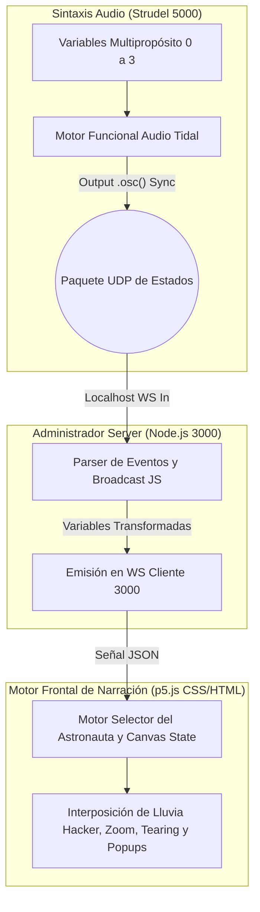

# 📤 Unidad 6 - Bitácora de Proyecto: "Ansiedad Digital (El Astronauta)"

---

## Actividad 01: Estética Visual de la Obra (Define)

**¿Qué tipo de visuales van a acompañar tu audio?**
Para acompañar la historia auditiva opté por representaciones figurativas soportadas por arte generativo en 2D. En lugar de limitarme a formas geométricas abstractas aisladas, utilicé Inteligencia Artificial para ilustrar a un **"Astronauta extraviado en un mar de ciberdatos"** con 4 diferentes niveles de degradación visual.

**¿Qué paleta de colores usarás y por qué?**
Predominancia de fondos negros espaciales con azules fríos y cyan tecnológico/matrix. Mi decisión central (tras probar con alarmas hiper-rojas estroboscópicas que dañaban la inmersión por ser cansinas a la vista) fue apoyarme en la pérdida de la luz. En el estado crítico o de "alarma", elimino el oxígeno visual alterando el lienzo hacia un gris azulado y fúnebre para dar la asfixia real.

**¿Cómo reaccionarán las visuales al audio? (Mapeo)**
- **SYNTH_PAD (Ambiente):** Transiciona entre los 4 fondos base del astronauta.
- **KICK_BEAT (Pulso):** Determina el latido general, causando zips de ahogo o Zoom bruscos a la cámara principal, simulando fallos de frecuencia cardíaca o latidos acelerados.
- **BASS_DRIVE (Bajo 303):** Se refleja en sismos directos; sacude violentamente el encuadre renderizado en el eje X/Y.
- **HIHAT_SWARM:** Multiplica la cantidad, densidad y velocidad de la "lluvia de código Matrix" que cae sobre el casco.
- **DATA_NOISE:** Esparce pop-ups falsos ("Ventanas de advertencia de error") flotando y disolviéndose iterativamente.
- **GLITCH_STORM:** Interviene con un Screen Tearing rítmico, rasgando bandas de la pantalla de forma lateral simulando estática vieja de radiocomunicación.
- **ALARM_STATE:** Absorbe la luz vívida y tiñe la pantalla de gris frío espectral, con el mensaje asfixiante intermitente "S I G N A L  L O S T".

**¿Por qué estas decisiones estéticas sirven al concepto de tu obra?**
Sirven directamente para personificar en pantalla cómo debe sentirse la "sobrecarga de información" en la era del ciber-estrés crónico. Ver a un usuario representado romperse daña más psicológicamente que simplemente ver figuras en pantalla estallar.

---

## Actividad 02: Exploración de Técnicas (Seek y Prototipado)

**Las técnicas exploradas y los prototipos realizados.**
Inicialmente encaré la visualización armando todo un entorno procedural en `WebGL` dentro de *p5.js* (Sistemas 3D generativos de Mallas a partir de *Perlin Noise* con cilindros gigantes y monolitos). Mapeaba la música a estructuras físicas 3D volando a nuestro lado.

**Los resultados de cada prototipo (qué funcionó, qué no, qué ajustaste).**
- El motor en `WebGL` se veía sumamente vanguardista, pero *falló masivamente en rendimiento local*. Al activar todo, los ciclos de bucle destrozaban los fotogramas bajando drásticamente el FPS natural, y haciéndolo muy 'lageado' e insoportable a niveles de intensidad de partituras (BPM alto).
- Fue necesario hacer un "rolback" y rediseñar estructuralmente mi obra. Ajusté la técnica: volví al lienzo puramente en *2D clásico*, pero recargándolo de arte visual inteligente (pre-cacheados a la tarjeta con `.preload()`), y utilizando el procesado de imágenes directo junto a partículas simples.

**La técnica o combinación elegida.**
Un entorno 2D interactivo (`p5.js` básico) con Imágenes base alimentada modularmente por capas alpha y traslaciones bidimensionales cruzadas. Solucionó rotundamente el LAG sin perder carga cognitiva/psicológica.

---

## Actividad 03: Implementación e integración audiovisual (Apply)

**El proceso de implementación y cómo lograste sincronización:**
Implementé toda la infraestructura sobre WebSocket directo, deshaciéndome de VJs intermedios como TouchDesigner para bajar cualquier lag entre comandos. Escribí un puente ligero en **Node.js (`OSCBridge`)** con `ws` que espera los comandos UDP y escucha la directiva nativa pura de `Strudel` (`() => .osc()`). Todo el audio en milisegundos reales se manda en `JSON` al renderizado 2D.

**Código de sincronía (Strudel Core):**
```javascript
$: stack(PAD, BASS, KICK, HIHAT, DATA, GLITCH, VOICE, ALARM).gain(0.8)
$: stack(PAD.osc(), BASS.osc(), KICK.osc(), HIHAT.osc(), DATA.osc(), GLITCH.osc(), VOICE.osc(), ALARM.osc())
```

**Instrucciones de reproducción de la Obra hasta este punto:**
1. Despliega el puente con `node bridge.js` (puerto 8080 local habilitado).
2. Arranca el motor nativo Strudel para Live coding con `pnpm dev --port 5000`.
3. Navega de inmediato a `http://localhost:5000/visualesHouse.html`. 
4. Escribe el loop en Strudel y dispara con **Shift+Enter**. Ajusta las densidades del 0 al 3 desde las declaraciones let en caliente para ver al sistema transicionar las vistas del astronauta y sobrecargar su pantalla con notificaciones y sismos.

### Código Completo del Puente (bridge.js)

```javascript
const { Server } = require('node-osc');
const { WebSocketServer } = require('ws');

// ═══════════════════════════════════════════════════
// OSC Bridge v3.0 — Tormenta de Datos (p5.js Edition)
// Strudel (WebSocket 8080 / OSC 3333) → p5.js (WebSocket 3000)
// Este puente recibe las métricas de Strudel y las 
// transfiere directamente a visualesHouse.html para el Mini Domo.
// ═══════════════════════════════════════════════════

const OSC_IN_PORT = 3333;
const WS_IN_PORT = 8080;
const WS_OUT_PORT = 3000;

// Estado de niveles
let currentLevels = {
    SYNTH_PAD: 0, BASS_DRIVE: 0, KICK_BEAT: 0, HIHAT_SWARM: 0,
    DATA_NOISE: 0, GLITCH_STORM: 0, VOICE_CHOP: 0, ALARM_STATE: 0
};

// --- SERVIDOR WEBSOCKET SALIDA (Hacia p5.js en el navegador) ---
const wssOut = new WebSocketServer({ port: WS_OUT_PORT });
let p5Clients = [];

wssOut.on('connection', (ws) => {
    console.log('[+] Visuales en p5.js conectadas al puerto 3000.');
    p5Clients.push(ws);
    
    // Entregar estado actual al conectar
    ws.send(JSON.stringify({ address: '/levels', levels: currentLevels }));

    ws.on('close', () => {
        p5Clients = p5Clients.filter(client => client !== ws);
        console.log('[-] Visuales en p5.js desconectadas.');
    });
});

function broadcastToP5(data) {
    const message = JSON.stringify(data);
    p5Clients.forEach(client => {
        if (client.readyState === 1) { // 1 = OPEN
            client.send(message);
        }
    });
}

// --- PROCESAMIENTO DE MENSAJES (Común para OSC y WS) ---
function processStrudelMessage(data) {
    let rawAddress = data.address || data[0];

    // ── NIVELES DE INTENSIDAD (0-3) ──
    if (rawAddress === '/levels') {
        const levels = data.args;
        for (const [key, value] of Object.entries(levels)) {
            if (currentLevels.hasOwnProperty(key) && currentLevels[key] !== value) {
                currentLevels[key] = value;
                console.log(`[📊 NIVEL] ${key} = ${value}`);
            }
        }
        // Retransmitir niveles
        broadcastToP5({ address: '/levels', levels: currentLevels });
        return;
    }

    // ── TRIGGERS RITMICOS ──
    if (rawAddress === '/dirt/play') {
        let argsArray = data.args || data;
        let soundName = null;
        let cps = 1;

        // Extraer 's' (sonido) y 'cps' (velocidad) de Strudel
        for (let i = 0; i < argsArray.length; i++) {
            let item = argsArray[i];
            let val = item.value !== undefined ? item.value : item;
            if (val === 's' && i + 1 < argsArray.length) {
                let nextItem = argsArray[i + 1];
                soundName = nextItem.value !== undefined ? nextItem.value : nextItem;
            }
            if (val === 'cps' && i + 1 < argsArray.length) {
                let nextItem = argsArray[i + 1];
                cps = nextItem.value !== undefined ? nextItem.value : nextItem;
            }
        }

        if (soundName) {
            let channelName = '';
            
            // Asignación de canales basándonos en los bancos del código
            if (soundName.includes('saw') || soundName.includes('pad')) channelName = 'PAD';
            else if (soundName.includes('tb303') || soundName.includes('bass')) channelName = 'BASS';
            else if (soundName.includes('bd') || soundName.includes('kick')) channelName = 'KICK';
            else if (soundName.includes('hh') || soundName.includes('hat')) channelName = 'HIHAT';
            else if (soundName.includes('bleep') || soundName.includes('cpu') || soundName.includes('print')) channelName = 'DATA';
            else if (soundName.includes('glitch') || soundName.includes('hc')) channelName = 'GLITCH';
            else if (soundName.includes('vocal')) channelName = 'VOICE';
            else if (soundName.includes('sine')) channelName = 'ALARM';

            if (channelName) {
                broadcastToP5({ address: '/trigger', channel: channelName, cps: cps });
                console.log(`[⚡ TRIG] ${channelName} (${soundName})`);
            }
        }
    } else {
        // Enviar triggers o variables custom directamente
        let val = data.args ? (data.args[0].value !== undefined ? data.args[0].value : data.args[0]) : 1;
        broadcastToP5({ address: rawAddress, value: val });
    }
}


// --- SERVIDOR WEBSOCKET ENTRADA (Manejador preferido para Strudel Web) ---
const wssIn = new WebSocketServer({ port: WS_IN_PORT });

wssIn.on('connection', (ws) => {
    console.log('[+] Strudel (Web) conectado por puerto 8080.');
    ws.on('message', (message) => {
        try {
            const data = JSON.parse(message);
            processStrudelMessage(data);
        } catch (e) {}
    });
});

// --- SERVIDOR OSC UDP ENTRADA (Soporte alternativo nativo) ---
try {
    const oscServer = new Server(OSC_IN_PORT, '127.0.0.1', () => {
        console.log(`[+] Escuchando OSC UDP en 127.0.0.1:${OSC_IN_PORT}`);
    });

    oscServer.on('message', (msg) => {
        try {
            const address = msg[0];
            const args = msg.slice(1);
            
            // Adaptar argumentos de UDP OSC a formato de Objeto JSON Strudel
            if(address === '/dirt/play') {
                const formattedArgs = [];
                for (let i = 0; i < args.length; i += 2) {
                    formattedArgs.push(args[i]);          // key
                    formattedArgs.push({ value: args[i+1] }); // value obj
                }
                processStrudelMessage({ address: address, args: formattedArgs });
            } else {
                processStrudelMessage({ address: address, args: args });
            }
        } catch(e) {}
    });
} catch(err) {
    console.log("[!] No se pudo iniciar el servidor OSC (posible uso exclusivo de WS).");
}

// Heartbeat de seguridad: Sincroniza variables a p5.js cada medio segundo
setInterval(() => {
    broadcastToP5({ address: '/levels', levels: currentLevels });
}, 500);

console.log('══════════════════════════════════════════════════════');
console.log('⚡ OSC Bridge v3.0 — Ansiedad Digital (P5.JS Edition)');
console.log(`📥 RECIBIENDO DE STRUDEL vía WS en puerto: ${WS_IN_PORT}`);
console.log(`📡 ENVIANDO A P5.JS vía WS en puerto: ${WS_OUT_PORT}`);
console.log('══════════════════════════════════════════════════════');
```

### Código Completo del p5.js (visualesHouse.html)

```html
<!DOCTYPE html>
<html lang="es">
<head>
    <meta charset="UTF-8">
    <title>Ansiedad Digital | El Astronauta</title>
    <script src="https://cdnjs.cloudflare.com/ajax/libs/p5.js/1.10.0/p5.js"></script>
    <style>
        body, html { margin: 0; padding: 0; overflow: hidden; background: #010409; font-family: 'Courier New', Courier, monospace; }
        canvas { display: block; }
        #status { position: absolute; top: 10px; left: 10px; color: #00ffff; z-index: 100; font-size: 14px; font-weight: bold; text-shadow: 0 0 5px #00aaff; }
    </style>
</head>
<body>
<div id="status">◆ RECEPCIÓN DE TELEMETRÍA (PUERTO 3000)... ◆</div>

<script>
// ----- Conexión al OSCBridge -----
let levels = {
    SYNTH_PAD: 0, BASS_DRIVE: 0, KICK_BEAT: 0, HIHAT_SWARM: 0,
    DATA_NOISE: 0, GLITCH_STORM: 0, VOICE_CHOP: 0, ALARM_STATE: 0
};
let triggers = {
    PAD: 0, BASS: 0, KICK: 0, HIHAT: 0, DATA: 0, GLITCH: 0, VOICE: 0, ALARM: 0
};

const ws = new WebSocket("ws://127.0.0.1:3000");

ws.onopen = () => {
    document.getElementById('status').innerText = '◆ TELEMETRÍA RECIBIDA ◆';
    setTimeout(() => { document.getElementById('status').style.opacity = '0.1'; }, 3000);
};

ws.onclose = () => {
    document.getElementById('status').innerText = '⚠ ERROR CRÍTICO: SEÑAL DE RADIO PERDIDA ⚠';
    document.getElementById('status').style.opacity = '1';
    document.getElementById('status').style.color = '#ff3333';
};

ws.onmessage = (msg) => {
    try {
        let packet = JSON.parse(msg.data);
        if (packet.address === '/levels') {
            levels = { ...levels, ...packet.levels };
        } else if (packet.address === '/trigger') {
            triggers[packet.channel] = 1.0;
        }
    } catch(e) {}
};

// ----- Sketch p5.js: El Viaje del Astronauta (2D) -----

let bgImages = [];
let matrixChars = "010203040506070809ABCDEFGHIJKLMNOPQRSTUVWXYZ<>{}[]$#".split("");
let matrixRain = [];
let errorPopups = [];

function preload() {
    // Cargamos los 4 fondos generados con IA para las 4 etapas de ansiedad
    // (Asegurándonos de que ya estén en la carpeta public/img)
    bgImages[0] = loadImage('img/astro_0.png');
    bgImages[1] = loadImage('img/astro_1.png');
    bgImages[2] = loadImage('img/astro_2.png');
    bgImages[3] = loadImage('img/astro_3.png');
}

function setup() {
    createCanvas(windowWidth, windowHeight);
    imageMode(CENTER);
    rectMode(CENTER);
    
    // Iniciar lluvia de código matrix (HIHAT_SWARM)
    for (let i = 0; i < 300; i++) {
        matrixRain.push({
            x: random(width), 
            y: random(-height * 2, 0), 
            speed: random(5, 15), 
            char: random(matrixChars)
        });
    }
}

function draw() {
    // 1. Decadencia de Triggers
    for(let k in triggers) triggers[k] *= 0.85; 
    
    background(5); // Fondo oscuro en caso de bordes
    
    // 2. Transición del Entorno (SYNTH_PAD define la fase de locura del Astronauta del 0 al 3)
    let currentLvl = min(3, max(0, round(levels.SYNTH_PAD))); 
    let currentImage = bgImages[currentLvl];

    // 3. Físicas de Cámara: Sismos espaciales por BASS_DRIVE y KICK_BEAT
    let shakeX = (levels.BASS_DRIVE * 10 * triggers.BASS) + (levels.KICK_BEAT * 5 * triggers.KICK);
    let shakeY = (levels.BASS_DRIVE * 10 * triggers.BASS) + (levels.KICK_BEAT * 5 * triggers.KICK);
    // El KICK simula los latidos cardíacos asfixiantes (Zoom in / out)
    let kickZoom = triggers.KICK * 0.05 * levels.KICK_BEAT;

    push();
    translate(width/2 + random(-shakeX, shakeX), height/2 + random(-shakeY, shakeY));
    
    // Escalado Responsivo tipo "Cover"
    let aspect = currentImage.width / currentImage.height;
    let drawW = width * (1 + kickZoom);
    let drawH = width / aspect;
    if (drawH < height) {
        drawH = height * (1 + kickZoom);
        drawW = height * aspect;
    }
    
    // 4. Asfixia Sensorial (ALARM_STATE)
    // En lugar del flash rojo estroboscópico, removemos toda la luz dando un filtro macabro y frío.
    if (levels.ALARM_STATE > 1) {
        // Tinte azul frío oscuro y pérdida de saturación severa
        tint(80, 130, 200, 255); 
    } else {
        noTint();
    }
    
    image(currentImage, 0, 0, drawW, drawH);
    pop();

    // 5. HIHAT SWARM (Lluvia de Código)
    if (levels.HIHAT_SWARM > 0) {
        fill(0, 255, 255, 180); // Cyan
        textFont('Courier New');
        textSize(14 + levels.HIHAT_SWARM * 2);
        
        let rainSpeedMultiplier = 1 + triggers.HIHAT * 2;
        let rainDensity = min(matrixRain.length, levels.HIHAT_SWARM * 100);
        
        for (let i = 0; i < rainDensity; i++) {
            let m = matrixRain[i];
            m.y += m.speed * rainSpeedMultiplier;
            if (m.y > height) m.y = random(-200, 0);
            if (random() < 0.1) m.char = random(matrixChars); // Parpadeo binario
            
            // Falso efecto de resplandor
            if(random()>0.9) text(m.char, m.x, m.y);
            text(m.char, m.x, m.y);
        }
    }

    // 6. DATA NOISE (Ventanas Pop-Up de Error de Sistema Ficticias)
    if (triggers.DATA > 0.8 && errorPopups.length < (levels.DATA_NOISE * 5)) {
        errorPopups.push({
            x: random(width*0.2, width*0.8),
            y: random(height*0.2, height*0.8),
            w: random(250, 400),
            h: random(100, 150),
            alpha: 255,
            errorCode: "0x0" + floor(random(1000,9999))
        });
    }

    for (let i = errorPopups.length - 1; i >= 0; i--) {
        let ep = errorPopups[i];
        ep.alpha -= 2; // Desvanecimiento de memoria
        if (ep.alpha <= 0) {
            errorPopups.splice(i, 1);
            continue;
        }
        
        push();
        translate(ep.x, ep.y);
        rectMode(CENTER);
        stroke(200, ep.alpha);
        strokeWeight(1);
        
        // Ventana principal
        fill(10, 10, 30, ep.alpha);
        rect(0, 0, ep.w, ep.h);
        
        // Barra Azul clásica de ventanas
        fill(0, 50, 150, ep.alpha);
        rect(0, -ep.h/2 + 10, ep.w, 20); 
        
        // Texto
        fill(255, ep.alpha);
        noStroke();
        textAlign(CENTER, CENTER);
        textFont('Arial');
        textSize(12);
        text("SYSTEM WARNING", 0, -ep.h/2 + 10);
        
        fill(255, 50, 50, ep.alpha);
        textSize(14);
        text("CRITICAL OVERLOAD: " + ep.errorCode, 0, 0);
        
        // Glitch en la propia ventana de error
        if (levels.GLITCH_STORM > 1) {
             translate(random(-10, 10), random(-5,5));
             fill(255, 255, 255, ep.alpha * 0.5);
             text("CRITICAL OVERLOAD: " + ep.errorCode, 0, 0);
        }
        pop();
    }

    // 7. GLITCH STORM (Pérdida de señal estática - Tearing)
    // Copiamos trozos del canvas y los pegamos desfasados
    if (levels.GLITCH_STORM > 0 && random() < (triggers.GLITCH * 0.7 + 0.1)) {
        let slices = levels.GLITCH_STORM * 2;
        for(let i=0; i<slices; i++) {
            let hSlice = random(10, 80);
            let yPos = random(height);
            let xOffset = random(-100, 100) * levels.GLITCH_STORM;
            copy(0, yPos, width, hSlice, xOffset, yPos, width, hSlice);
        }
    }
    
    // 8. TEXTO PSICOLÓGICO DEL ALARM STATE
    if (levels.ALARM_STATE > 0) {
        fill(200, 230, 255, 30 + triggers.ALARM * 100);
        textSize(60 + triggers.ALARM * 30);
        textAlign(CENTER, CENTER);
        textFont('Courier New');
        // Letras extra espaciadas que generan zozobra
        text("S I G N A L   L O S T", width/2, height/2 + (Math.sin(frameCount*0.1)*20));
    }
}

function windowResized() { 
    resizeCanvas(windowWidth, windowHeight); 
}
</script>
</body>
</html>
```

---

## Actividad 04: Consolidación y metacognición (Reflect)

**Evalúa la coherencia entre audio y visuales... ¿Se logra la experiencia deseada?**
Lo logré satisfactoriamente. Tras varios traspiés intentando geometrías (donde yo mismo y los revisores sentían vacía la propuesta), este *rediseño narrativo/ilustrado* capturó a la perfección ese sentimiento "agotador y ahogante" sin dañar la fluidez cibernética experimental. Me complace altamente haber invertido mi tiempo corrigiendo el efecto de alarma rojo estroboscópico por un color gris pálido tenebroso "SIGNAL LOST", dándole el punto inmersivo y no uno invasivo a la retina.

**Mi Diagrama de Sistema Final:**


**Principales desafíos enfrentados:**
Entender cómo sacrificar el "gran atractivo técnico" (como las tormentas de WebGL 3D) en favor del "gran funcionamiento técnico" (60 fps ininterrumpibles) sin que la premisa estética visual muriera en el intento. La flexibilidad fue mi gran activo al aprender a reconstruir sistemas visuales combinando métodos pre-renderizados en Canvas.